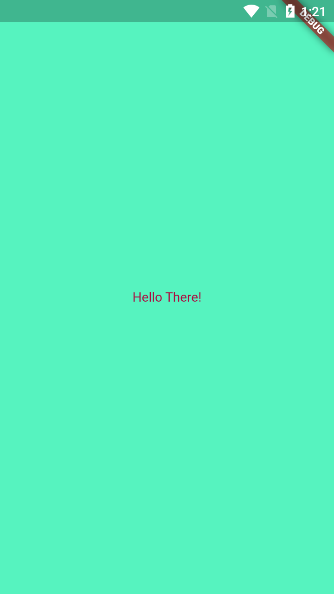
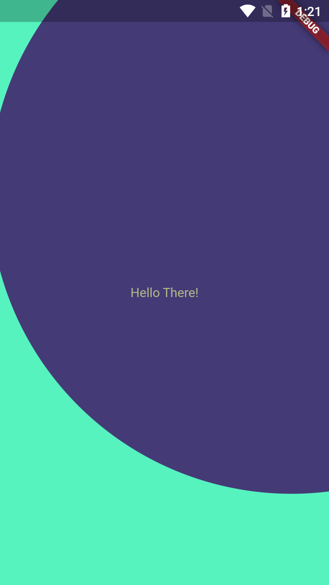

# Color Generator

A simple Flutter app that generates random colors with an awesome animation.

## Features

- Generate random RGB colors
- Display the current color
- Tap the screen to generate a new color
- Invert the color to use as text color
- Clip path animation on color change

## Screenshots

 

## Getting Started

To get started with the Color Generator app, follow these steps:

1. Install Flutter: Follow the installation guide for your operating system on the Flutter website.
2. Clone the repository: git clone https://github.com/youssufhebish/color-generator.git.
3. Navigate to the project directory: cd color-generator.
4. Install the dependencies: flutter pub get.
5. Run the app: flutter run.

## How to use

- Tap anywhere on the screen to generate a new random color.